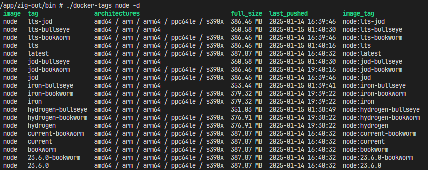

# docker-tags-zig



Search [dockerhub](https://hub.docker.com/) tags. I made it using Zig.

```
 Usage: docker-tags [options] <IMAGE>...

 Description: Search for image tags from DockerHub

    -h, --help
            Display this help and exit.

    -v, --version
            Output version information and exit.

    -i, --with-image
            Connect and display image names and tags.

    -b, --browse
            Open the URL in the browser.

    -l, --limit <count>
            Limit the number of tags to display. (default: 30)

    -d, --detail
            Displays detailed information in table.

    <IMAGE>...
```

## usage

```bash
docker-tags node
docker-tags tensorflow/tensorflow -i # Image name and tag in combination, such as python:latest
docker-tags python -l 100 # Set the number of searches. default 30.
docker-tags python -b # Display the DockerHub page in your browser (Linux must be able to use xdg-open)
```

Basically, it appears as follows:

```
$ docker-tags node
lts-jod
lts-bullseye
lts-bookworm
lts
latest
...
```

### detail view

Use the `-d` option to display the table and see more detailed information.

```
$ docker-tags node -d
image  tag                architectures                          full_size  last_pushed          image_tag
node   lts-jod            amd64 / arm / arm64 / ppc64le / s390x  386.46 MB  2025-01-14 16:39:46  node:lts-jod
node   lts-bullseye       amd64 / arm / arm64                    360.58 MB  2025-01-15 01:40:30  node:lts-bullseye
node   lts-bookworm       amd64 / arm / arm64 / ppc64le / s390x  386.46 MB  2025-01-14 16:39:46  node:lts-bookworm
node   lts                amd64 / arm / arm64 / ppc64le / s390x  386.46 MB  2025-01-15 01:40:16  node:lts
node   latest             amd64 / arm / arm64 / ppc64le / s390x  387.87 MB  2025-01-14 16:40:32  node:latest
node   jod-bullseye       amd64 / arm / arm64                    360.58 MB  2025-01-15 01:40:30  node:jod-bullseye
node   jod-bookworm       amd64 / arm / arm64 / ppc64le / s390x  386.46 MB  2025-01-14 19:40:16  node:jod-bookworm
node   jod                amd64 / arm / arm64 / ppc64le / s390x  386.46 MB  2025-01-14 16:39:46  node:jod
node   iron-bullseye      amd64 / arm / arm64                    353.44 MB  2025-01-15 01:39:41  node:iron-bullseye
node   iron-bookworm      amd64 / arm / arm64 / ppc64le / s390x  379.32 MB  2025-01-14 19:39:22  node:iron-bookworm
node   iron               amd64 / arm / arm64 / ppc64le / s390x  379.32 MB  2025-01-14 19:39:22  node:iron
node   hydrogen-bullseye  amd64 / arm / arm64                    351.03 MB  2025-01-15 01:38:49  node:hydrogen-bullseye
...
```

## with Docker CLI

It can be used as a docker cli plugin (v0.1.2~). That is, this tool can also be used as a subcommand of `docker`.

For example:

```bash
docker tags ubuntu -d
```

To use it as a plugin, place the `docker-tags` binary in the following location:

- `~/.docker/cli-plugins`

## env

- It is built for Windows, Linux x86_64, and MacOS aarch64.
- The author has only tested Windows and Linux builds.
- I have not done any code signing or anything else to the tool. Note that files in the release may be detected by virus scanning. I assume no liability whatsoever for the release files.
- Only publicly API accessible images are supported
- API endpoints use v2
- zig 0.13.0

## why did you create this?

With Zig, this is due to the motivation to make it cross-platform and small binary.
I created it by hand and am satisfied with its size of approximately 1000 KB, which is much smaller for my personal tool.
There are [several better similar tools](https://github.com/goodwithtech/dockertags).

## credits

The following third-party libraries are used:

- [zig-clap](https://github.com/Hejsil/zig-clap) by Hejsil (MIT)
- [zul](https://github.com/karlseguin/zul) by karlseguin (MIT)
- [chroma-zig](https://github.com/adia-dev/chroma-zig/) by adia-dev (MIT)
- [prettytable-zig](https://github.com/dying-will-bullet/prettytable-zig) by dying-will-bullet (MIT)

## NOTE

This is a completely personal tool and the author has no intention of maintaining it for anyone but himself.
Sorry, but please be aware that issues and pull requests in this repository will be ignored.
You are free to customize your own work using forking and source code.
I hope that by making it open source, it will be useful to someone for something!

Zig is difficult for me as a beginner, but fun! 👍
